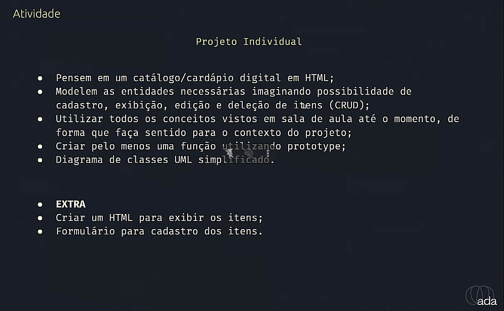

# Projeto Individual Santander Coders

## O projeto

## Layout
Base layout: https://diegonf.github.io/Project__AluraChallenge__AluraGeek/home/

## Pendencias
* edit do CRUD
* Prototype
* Diagramas UML
* Melhorar acesso objs DOM da classe Form
* Corrigir dimensões dos cards no flex